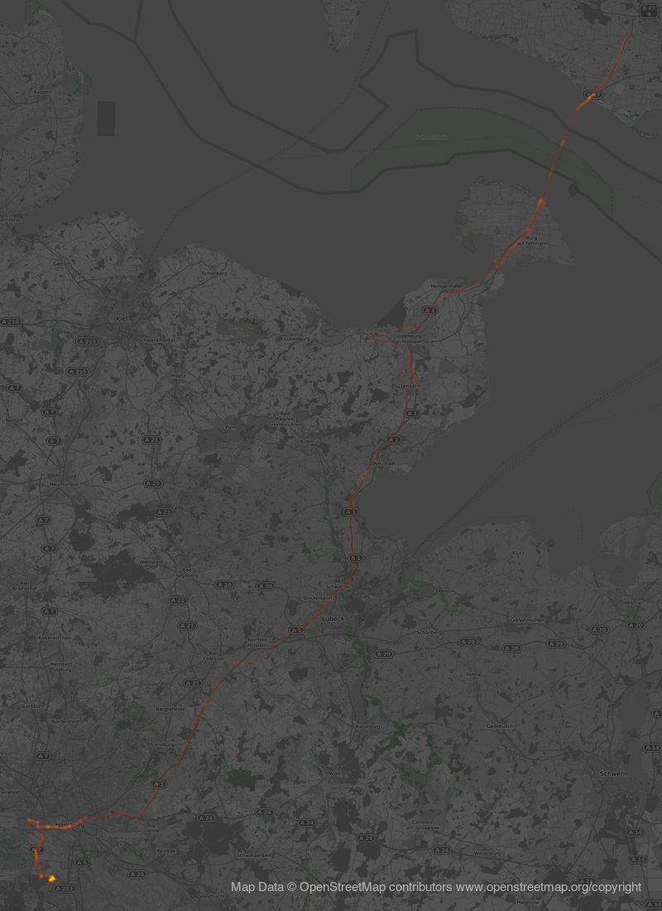

# heatmapstuff - struggle with locationdata 

I started to play with location data and remembered my google location
data which are collected since 2011 by my mobile.

I was interested in plotting all my moves into a map, in a best scenario as a heatmap.

That worked out [fine with manually created (e.g. gps device)
data](https://leben-auf-dem-boden.de/wordpress/wp-content/uploads/2021/12/2021-11-bike.png),
but very bad with google location data. I poked around to find if it is
possible to fix the errors (semi)automated.

As far as i tested now, it is not (easy) possible:

### Unclear location data: Calculate distances between geocoordinates

To eliminate the lazy (batterysafe) location aquisition by 'known' gsm and wifi
locations (with often wrong/old/moving positions) which create [this anoying
rays into nowhere (scroll!)](maps/googlelocation.png) i needed to find and
remove them.

> It is interesting to know that i do know in deed some of the 'nowhere'
> locations. :-) One (shown in the 1st map pictured below) is the location where i used a mobile
> wifi2gsm router at the first time. It looks like google acquires the position
> of a new, never noted wifi through a connected device with position (my mobile
> with gps chip) and connects this position to the ESSID/Mac of the wifi network
> in a database and does not take into account that wifis may move.
>
> I had some similar cases years ago, one in [train with
wifi](https://www.facebook.com/photo.php?fbid=1347765448587142&set=pb.100000610990660.-2207520000..&type=3) and
> one as we moved into a new flat - we have been able to hack a [ingress portal](https://ingress.com/) located just
> in front of the old flat, if we have been connected to the (same) wifi hardware in the new flat. 
>
>I consider that this is a known problem to google, but they dont care.

I started to compute the distance between the neighbor trackpoints with the
[haversine formula](https://en.wikipedia.org/wiki/Haversine_formula) to compute
the distances in bash with
[bc](http://rosettacode.org/wiki/Haversine_formula#bc) and drop the 2nd if it
is more than 15km away from the 1st position.

If there are multiple occurencies of the same (wrong) spot, i delete all of
them. Afterwards i restart the script for a new run (by a while loop).

This needs A LOT of time, but the maps are much better after that... 

**... as long as there is no real distance in the track which has really no
position for a longer distance.**
That happens for instance if you going on a
seagoing ferry to ride to Bornholm or a simple flight. :-(

**So - been there, done that. No solution so far. Project stopped.**

But you might be interested anyhow, so take a look.

#### Plot with untouched google locationdata from 2016-03-14


We used a portable wifi2gsm router in denmark (2016 had still expensive roaming
fees, we bought one dk sim card and used it together in the car). One of the
offtrack locations is the [sheep farm](https://www.schaeferei-hullerbusch.de/)
of a friend where i used the same device the first time (years before 2016).

#### Plot with cleaned data 2016-03-14

heatmap.py creates the map section on its own, so it is smaller.



The script is still dangerous: [load-trackfile.sh](bin/load-trackfile.sh) -
have a copy of your precious data before tinkering around with it!

## used tools

### heatmap.py

Old, but paid :-)
[heatmap.py](https://sethoscope.net/heatmap/) 

Needs [this patch](https://github.com/sethoscope/heatmap/pull/62) to work with recent version of [osmviz](https://github.com/hugovk/osmviz)

Makes nice heatmaps, if you do **not** use google location data but real gps data.


```
OSMBASE=https://tiles.wmflabs.org/bw-mapnik
./heatmap.py -B 0.35 -o 2021-11.png --osm --osm_base $OSMBASE -H 2400 --margin 50 --decay 0.90 ~/gd_local/tracks/2021/2021-11
```

If you combine real and google guessed data, it might look like this one (click to enlarge):


I was in fact on the island Amrum, but not on Föhr or Sylt, but my mobile connected to gsm
antennas there; and i used the train to Schleswig and from Husum, and the train
used the railway as mapped, not the plot printed by the gsm connections. 
The trains from Cuxhaven and Lübeck did it better :-) 

### OSM tile server 

Heatmap.py uses OSM for the map layer, there are a lot of possible maps out there, take a look at
[OSM tile servers listing](https://wiki.openstreetmap.org/wiki/Tile_servers) to compare and find the suitable for your needs.

I like https://tiles.wmflabs.org/bw-mapnik (bw, free - used by the example maps)

You need to mention the [openstreetmap copyright](https://www.openstreetmap.org/copyright) if you using OSM map tiles!

### splitting google-location-history in single day files

If you get your google location history via [google
takeout](https://takeout.google.com/}, use the kml export if you want to use
the typical gis tools and not the json export (which is default).

This nice script converts kml into gpx.

[google-location-history-to-gpx](https://gist.github.com/juliushaertl/743704745b953fb54f9fca27ed124078)

### gpsbabel

The swiss army knife for location data. https://www.gpsbabel.org/
Used it to split the all.gpx file in daily files.

