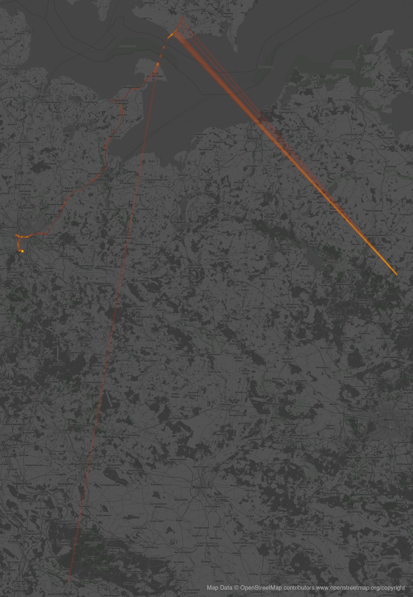

# heatmapstuff
struggle with locationdata :-)

## tools

### heatmap.py

Old, but paid :-)
[heatmap.py](https://sethoscope.net/heatmap/) 

Needs [this patch](https://github.com/sethoscope/heatmap/pull/62) to work with recent version of [osmviz](https://github.com/hugovk/osmviz)

### OSM tile server 

[OSM tile servers listing](https://wiki.openstreetmap.org/wiki/Tile_servers) 

I like https://tiles.wmflabs.org/bw-mapnik (bw, free)

You need to mention the [openstreetmap copyright](https://www.openstreetmap.org/copyright) if you using OSM map tiles!

### splitting google-location-history in single day files

[google-location-history-to-gpx](https://gist.github.com/juliushaertl/743704745b953fb54f9fca27ed124078)

### gpsbabel

The swiss army knife for location data. https://www.gpsbabel.org/

### calculate distances between geocoordinates

To eliminate the lazy (batterysafe) location aquisition by 'known' gsm and wifi
locations (with often wrong/old/moving positions) which create this anyoing rays into nowhere
i needed to find and remove them.


I started to compute the distance between the neighbor trackpoints and remove
the 2nd if it is more than 15km away from the 1st.

If there are multiple occurencies of the same (wrong) spot, i delete all of them. Afterwards i restart the script.

This needs A LOT of time, but the maps are much better after that.

#### Original data


#### Cleaned data


The script is still dangerous: [load-trackfile.sh](bin/load-trackfile.sh) I
used [bc|bash implementation](http://rosettacode.org/wiki/Haversine_formula#bc)
of [the haversine formula](https://en.wikipedia.org/wiki/Haversine_formula) to compute the distances.


## running software

```
OSMBASE=https://tiles.wmflabs.org/bw-mapnik
./heatmap.py -B 0.15 -o 2021.png --osm --osm_base $OSMBASE -H 2400 --margin 50 --decay 0.90 ~/gd_local/Meine\ Tracks/tracks/2021/2021-11 ~/gd_local/Meine\ Tracks/tracks/2021/2021-11-
```

```
for i in 11 12 13 14 15 16 17 18 19 20 21 ; do echo -e "Now computing 20${i}" ; ~/data/gits/other/heatmap/heatmap.py -B 0.35 -o googlelocation-20${i}.png  --osm --osm_base $OSMBASE -H 2800 --margin 150 --decay 0.90  ./20${i}* ; done
```


## findings


### Ausreisser finden (manuell)

`grep metadata *gpx > metadata.txt`

Checken auf Auffälligkeiten, z.B. `2013-12-22T22_59_50Z.gpx:  <metadata><time>2013-12-22T22:59:50Z</time><bounds minlat="42.187154100" minlon="9.998949600" maxlat="53.594994400" maxlon="-3.699226700"/></metadata><trk>`

42° nördliche Breite ist eher ungewöhnlich. in der Datei dann nach `lat="42` suchen - in den Trackpoints.

```
      <trkpt lat="42.278356400" lon="-71.136786000">
        <ele>0.000</ele>
        <time>2014-01-02T11:22:24Z</time>
      </trkpt>
```

Diese dann rausschmeissen, wenn die davor und dahinter komplett anders sind.

Komische Sachen passieren:
```
      <trkpt lat="53.554675000" lon="10.082964100">
        <ele>0.000</ele>
        <time>2015-03-06T09:12:45Z</time>
      </trkpt>
      <trkpt lat="48.151925800" lon="11.583739800">
        <ele>0.000</ele>
        <time>2015-03-06T09:13:15Z</time>
      </trkpt>
      <trkpt lat="53.554667800" lon="10.082987800">
        <ele>0.000</ele>
        <time>2015-03-06T09:14:47Z</time>
      </trkpt>
```

Das ist Nadjas Wohnung und irgendwo in München.


